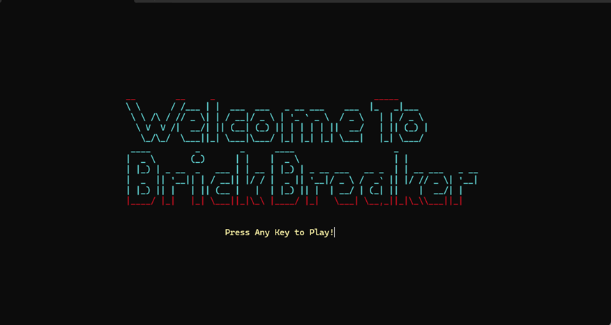
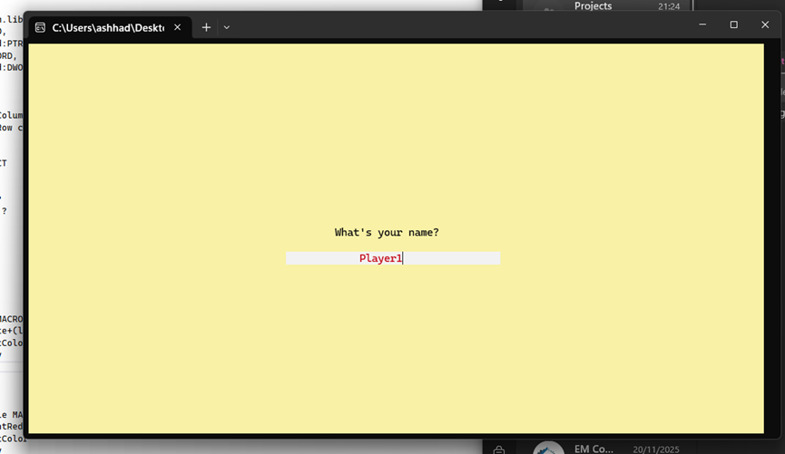
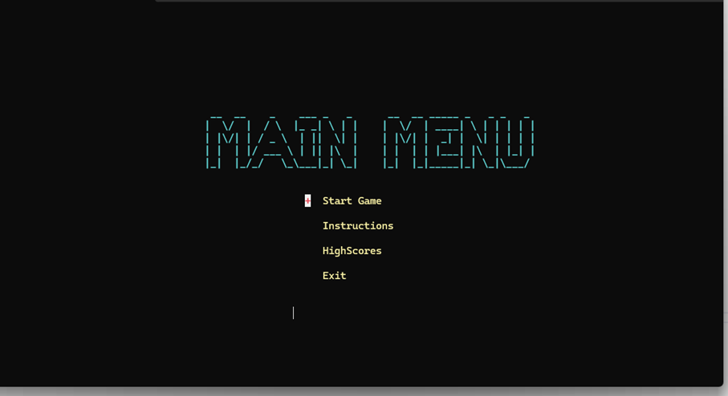
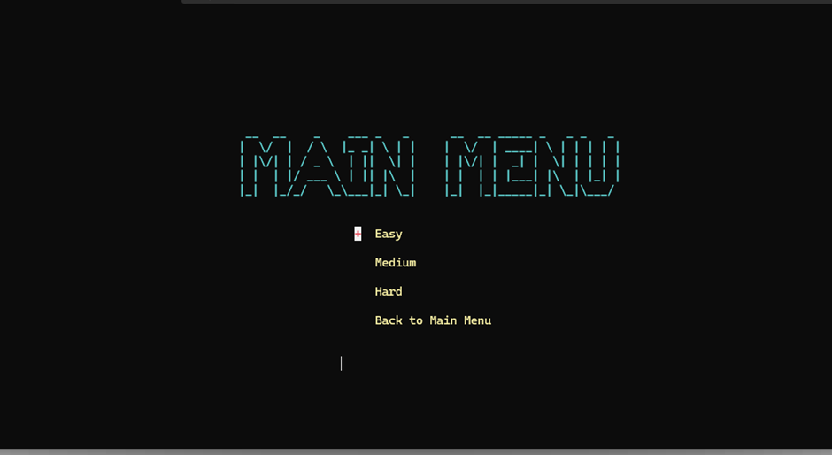
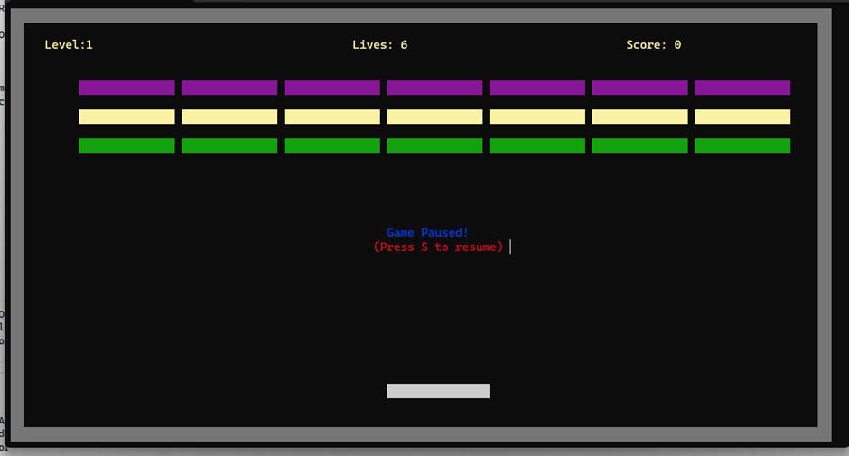
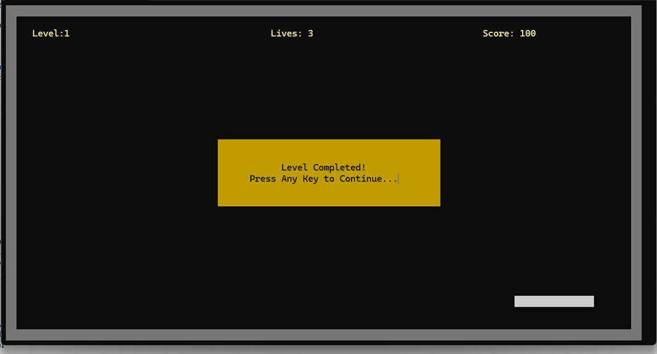
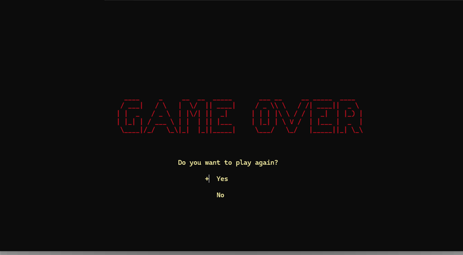
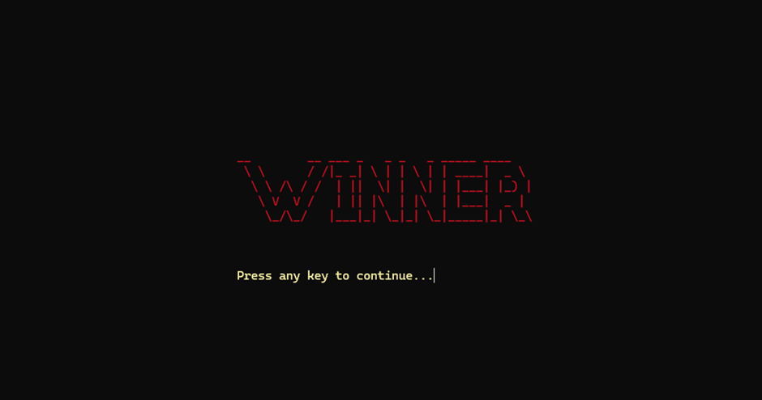

# 🧱 BrickBreaker-2 (COAL Project)

A classic **Brick Breaker** game built as a **4th Semester COAL (Computer Organization & Assembly Language)** project. The game recreates the nostalgic arcade experience where the player controls a paddle to bounce a ball and destroy bricks.

## 🎮 Features
- Paddle controlled by keyboard (Left / Right arrows)
- Ball physics with wall, paddle, and brick collision
- Score tracking and lives system
- Multiple levels / increasing difficulty
- Win / Lose screens

## 🖼️ Screenshots

  
  

  
  

  
  

  
  

## 🛠️ Technologies Used
- **Language:** Assembly Language
- **Assembler / IDE:** MASM / NASM / EMU8086
- **Platform:** Windows

## 📂 Project Structure
BrickBreaker-2/
├── src/                  # Source code files
├── screenshots/          # Screenshots for README
├── assets/               # Images, sounds
├── README.md
└── ...

## 🚀 How to Run
1. Clone the repository:
   git clone https://github.com/Fabiha188/BrickBreaker-COAL.git
2. Open the project in your IDE / assembler.
3. Build and run the main file.

## 🎯 Controls
| Key | Action |
|-----|--------|
| ←   | Move paddle left |
| →   | Move paddle right |
| ESC | Exit game |

## 👨‍💻 Author
**Fabiha**  
4th Semester — Computer Organization & Assembly Language Project

## 📜 License
This project is licensed under the MIT License.
